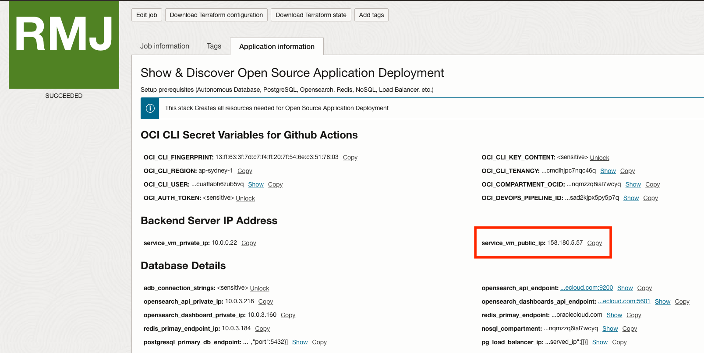

## Supremo Rental Quickstart

### 1. Setup baseline infrastructure

Click on the button below to deploy the baseline infrastructure using OCI Resource Manager.

[](https://cloud.oracle.com/resourcemanager/stacks/create?zipUrl=https://github.com/howowi/supremo-rental-quickstart/releases/download/v1.9.8/supremo_stack_v1.9.8.zip)

### 2. Deploy frontend application
**IMPORTANT**: Must complete the baseline infrastructure setup before following the steps below.

#### Github Repository Setup

1. Fork the [Supremo Rental Quickstart Github Repository](https://github.com/howowi/supremo-rental-quickstart) to your Github account. Follow the steps in this [link](https://docs.github.com/en/pull-requests/collaborating-with-pull-requests/working-with-forks/fork-a-repo?tool=webui#forking-a-repository) on the steps to fork a repository.

2. Clone the repository on your local terminal or Cloud Shell.

3. Navigate to Github repository settings.

    

4. Press "Actions" under "Secrets and variables" option.

    

5. Press "New repository secret" to create the following secrets.

    * OCI_CLI_FINGERPRINT (obtain from Resource Manager Outputs)
    * OCI_CLI_KEY_CONTENT (obtain from Resource Manager Outputs)
    * OCI_CLI_REGION (obtain from Resource Manager Outputs)
    * OCI_CLI_TENANCY (obtain from Resource Manager Outputs)
    * OCI_CLI_USER (obtain from Resource Manager Outputs)
    * OCI_COMPARTMENT_OCID (obtain from Resource Manager Outputs)
    * OCIR_USERNAME (Refer to [documentation](https://docs.oracle.com/en-us/iaas/Content/Registry/Tasks/registrypullingimagesusingthedockercli.htm))

        * **Example for non-federated user**: tenancynamespace/john@oracle.com
        * **Example for IDCS federated user**: tenancynamespace/oracleidentitycloudservice/john@oracle.com

    * OCI_AUTH_TOKEN (obtain from Resource Manager Outputs)
    * OCI_DEVOPS_PIPELINE_ID (obtain from Resource Manager Outputs)

    

6. On the same page, click on "Variables" and click "New repository variable" to add "BACKEND_IP" variable. Obtain the backend IP address from Resource Manager Outputs.

    

#### OKE Setup

1. Create ephemeral network definition on Cloud Shell to acccess the private OKE cluster. Alternatively, use OCI Bastion.

    * Cloud Shell: Refer to [documentation](https://docs.oracle.com/en-us/iaas/Content/API/Concepts/cloudshellintro_topic-Cloud_Shell_Networking.htm#Cloud_Shell_Private_Access).

    * OCI Bastion: Refer to [documentation](https://docs.oracle.com/en-us/iaas/Content/ContEng/Tasks/contengsettingupbastion.htm#contengsettingupbastion_topic_Access_Kubernetes_API_endpoint).

2. Create a namespace for supremo app
    ```
    kubectl create ns supremo
    ```

3. Create container registry secret to pull container image from OCI Container Registry. Refer to [documentation](https://docs.oracle.com/en-us/iaas/Content/Registry/Tasks/registrypullingimagesusingthedockercli.htm) for the values for `docker-username`, `docker-password` and `docker-server`.
    ```
    kubectl create secret docker-registry ocir-secret --docker-username='<tenancy_namespace>/<username>' --docker-password='<auth_token>' --docker-server=<region_code>.ocir.io --docker-email='<user_email>' -n supremo
    ```

4. Check that secret has been created
    ```
    kubectl get secrets -n supremo
    ```

#### OCI DevOps Setup

1. Navigate to OCI DevOps project.

    

2. Go to artifact and select "deploy_supremo_react".

    

3. Copy and paste the content of [deployment_supremo_frontend.yml](deployment/deployment_supremo_frontend.yml) to the artifact and save it.

4. Go to Logs and make sure DevOps logs is enabled

    

#### Update Code and Run Github Action

1.  Obtain the IP address of the backend server from Resource Manager Outputs.

    

2. Search for `<backend_ip>` across all the files in this repository and update it with the value from the previous step. Use OCI Code Editor or your preferred IDE for optimal experience.

3. Commit and push the changes to Github repo main branch.

4. Observe that Github Action will be triggered and OCI Deployment Pipeline will deploy Supremo frontend to OKE cluster.

5. Navigate to OCI DevOps project and click on the deployment

    

6. Under Deployment Progress, click on the 3 dots of `Wait for approval`, press `Approve`.

    

7. After deployment is completed, validate that the Supremo app is accessible. Get the public IP of the load balancer by running the command below:
    ```
    kubectl get svc -n supremo
    ```

    